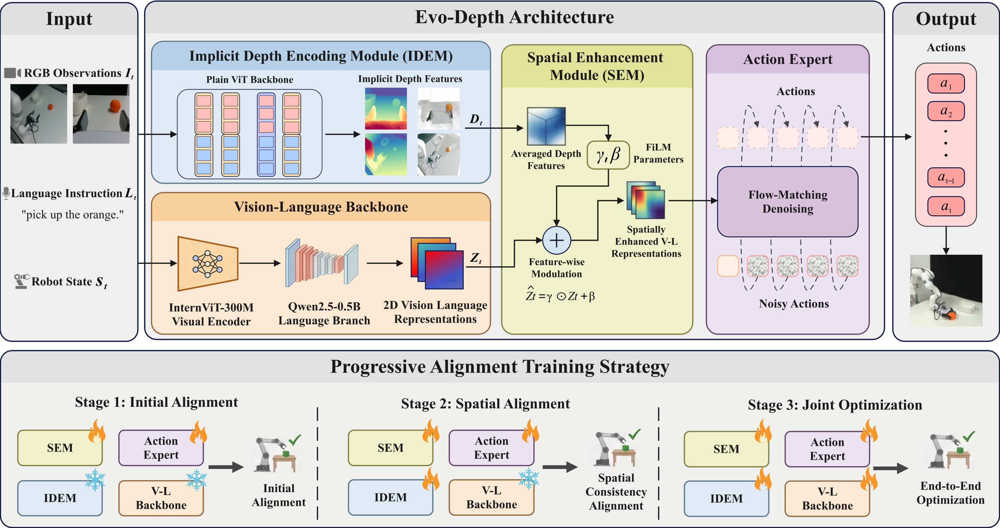

# EvoDepth
[](https://arxiv.org/abs/2605.14950)

Evo-Depth is a lightweight depth-enhanced vision-language-action (VLA) policy for robotic manipulation. It combines a vision-language backbone, an Implicit Depth Encoding Module (IDEM), and a Spatial Enhancement Module (SEM), then predicts continuous action chunks with a flow-matching action expert. The policy takes multi-view RGB observations, robot state, and a language instruction as input.

This repository provides:

- A websocket inference server shared by all simulation clients.
- Evaluation clients and scripts for LIBERO, LIBERO-PLUS, MetaWorld MT50, and VLA-Arena.
- LeRobot-format dataset loading for custom training data.
- A [Progressive Alignment Training](https://arxiv.org/abs/2605.14950) recipe in `Evo_depth/train.sh`: Initial Alignment (action expert + SEM), Spatial Alignment (IDEM + action expert + SEM), then Joint Optimization (full model).

The default server port is `9000`. Set `EVO_DEPTH_SERVER_PORT` and pass the matching `server_url` to each client if you need a different port.

## Table of contents

- [EvoDepth](#evodepth)
  - [Table of contents](#table-of-contents)
  - [Model architecture](#model-architecture)
  - [Installation](#installation)
  - [Simulation benchmark](#simulation-benchmark)
    - [Download pretrained weights](#download-pretrained-weights)
    - [LIBERO benchmark](#libero-benchmark)
      - [1. Prepare the environment for LIBERO](#1-prepare-the-environment-for-libero)
      - [2. Run LIBERO evaluation](#2-run-libero-evaluation)
    - [LIBERO PLUS benchmark](#libero-plus-benchmark)
      - [1. Prepare the environment for LIBERO-PLUS](#1-prepare-the-environment-for-libero-plus)
      - [2. Run LIBERO-PLUS evaluation](#2-run-libero-plus-evaluation)
        - [2.1 Start EvoDepth server](#21-start-evodepth-server)
        - [2.2 Run LIBERO-PLUS client](#22-run-libero-plus-client)
    - [MetaWorld benchmark (MT50)](#metaworld-benchmark-mt50)
      - [1. Environment (MetaWorld + client)](#1-environment-metaworld--client)
      - [2. Evaluation layout](#2-evaluation-layout)
      - [3. Run evaluation](#3-run-evaluation)
    - [VLA-Arena benchmark](#vla-arena-benchmark)
      - [1. Prepare the environment for VLA-Arena](#1-prepare-the-environment-for-vla-arena)
      - [2. Run VLA-Arena evaluation](#2-run-vla-arena-evaluation)
        - [2.1 Start EvoDepth server](#21-start-evodepth-server-1)
        - [2.2 Run VLA-Arena client](#22-run-vla-arena-client)
  - [Training on your own dataset](#training-on-your-own-dataset)
    - [1. Prepare data](#1-prepare-data)
    - [2. Modify config](#2-modify-config)
      - [2.1 `dataset/config.yaml`](#21-datasetconfigyaml)
      - [2.2 Parquet cache directory](#22-parquet-cache-directory)
    - [3. Start training](#3-start-training)
      - [3.1 Accelerate and DeepSpeed](#31-accelerate-and-deepspeed)

## Model architecture

High-level pipeline: multi-view RGB, language instruction, and robot state flow through IDEM and the vision-language backbone; SEM depth-aware modulation yields spatially enhanced representations, which the flow-matching action expert turns into an action chunk.

<p align="center">
  
</p>

## Installation

```bash
git clone https://github.com/MINT-SJTU/Evo-Depth.git

cd Evo_depth
conda create -n evo_depth python=3.10 -y
conda activate evo_depth
pip install -r requirements.txt
MAX_JOBS=64 pip install -v flash-attn --no-build-isolation
pip install --no-build-isolation git+https://github.com/nerfstudio-project/gsplat.git@0b4dddf04cb687367602c01196913cde6a743d70 # for gaussian head


```

## Simulation benchmark

All simulation clients and `Evo_depth_server.py` are aligned on **websocket port 9000**. Set `EVO_DEPTH_SERVER_PORT` if you need another port, and pass the same URL from each client (`--server_url`, shell scripts, or YAML).

Download checkpoints once (see [Download pretrained weights](#download-pretrained-weights)), set `EVO_DEPTH_CKPT_DIR`, then start `scripts/Evo_depth_server.py` in the `evo_depth` env before running any client below.

### Download pretrained weights

Install the Hugging Face CLI (any conda env is fine):

```bash
pip install huggingface_hub
```

Each released checkpoint is a directory containing `checkpoint.json`, `config.json`, `norm_stats.json`, and `mp_rank_00_model_states.pt`. Point `EVO_DEPTH_CKPT_DIR` at that directory before starting the server.

| Benchmark | Hugging Face repo | `EVO_DEPTH_CKPT_DIR` |
| --------- | ----------------- | -------------------- |
| LIBERO, LIBERO-PLUS | [MINT-SJTU/EVO-Depth-LIBERO](https://huggingface.co/MINT-SJTU/EVO-Depth-LIBERO) | `/path/to/checkpoint/<task_suite>/` (one suite per download) |
| MetaWorld (MT50) | [MINT-SJTU/EVO-Depth-MetaWorld](https://huggingface.co/MINT-SJTU/EVO-Depth-MetaWorld) | `/path/to/checkpoint/` (repo root) |
| VLA-Arena | [MINT-SJTU/EVO-Depth-Arena](https://huggingface.co/MINT-SJTU/EVO-Depth-Arena) | `/path/to/checkpoint/` (repo root) |

**LIBERO / LIBERO-PLUS** — one task suite per download (`libero_spatial`, `libero_goal`, `libero_object`, `libero_10`):

```bash
hf download MINT-SJTU/EVO-Depth-LIBERO \
  --local-dir /path/to/checkpoint/ \
  --include "libero_spatial/**"

export EVO_DEPTH_CKPT_DIR=/path/to/checkpoint/
```

**MetaWorld (MT50)**:

```bash
hf download MINT-SJTU/EVO-Depth-MetaWorld --local-dir /path/to/checkpoint/

export EVO_DEPTH_CKPT_DIR=/path/to/checkpoint
```

**VLA-Arena**:

```bash
hf download MINT-SJTU/EVO-Depth-Arena --local-dir /path/to/checkpoint/

export EVO_DEPTH_CKPT_DIR=/path/to/checkpoint
```

Optional: `export EVO_DEPTH_SERVER_PORT=9000` (default). Or edit defaults in `Evo_depth/scripts/Evo_depth_server.py` under `if __name__ == "__main__":`.

### LIBERO benchmark

#### 1. Prepare the environment for LIBERO

```bash
conda create -n libero python=3.8.13 -y

conda activate libero

cd LIBERO-evaluation/

git clone https://github.com/Lifelong-Robot-Learning/LIBERO.git

cd LIBERO

pip install -r requirements.txt

pip install torch==1.11.0+cu113 torchvision==0.12.0+cu113 torchaudio==0.11.0 --extra-index-url https://download.pytorch.org/whl/cu113

pip install -e .

pip install websockets
```

Use the **LIBERO** row in [Download pretrained weights](#download-pretrained-weights). When evaluating `libero_spatial`, set `EVO_DEPTH_CKPT_DIR` to the matching suite directory (e.g. `/path/to/checkpoint/libero_spatial`).

#### 2. Run LIBERO evaluation

```bash
# Terminal 1
conda activate evo_depth
cd Evo_depth
python scripts/Evo_depth_server.py

```

```bash
cd LIBERO-evaluation

# Usage: bash ./test_libero.sh [log_path] [task] [server_url]
# example:
bash ./test_libero.sh ./logs libero_spatial ws://127.0.0.1:9000
```

### LIBERO PLUS benchmark

#### 1. Prepare the environment for LIBERO-PLUS

Please follow the official GitHub repository to prepare the environment:  
[LIBERO-plus](https://github.com/LinqingZhong/LIBERO-plus)

Use the same **LIBERO** checkpoint as above; pick the suite that matches your `--task_suites` argument.

#### 2. Run LIBERO-PLUS evaluation

EvoDepth provides a small wrapper client and script in `LIBERO-PLUS-evaluation/`. Run the client from the **LIBERO-PLUS-evaluation** root. The client defaults to `ws://127.0.0.1:9000`, same as the EvoDepth server.

##### 2.1 Start EvoDepth server

This is the same server used for LIBERO:

```bash
# Terminal 1
conda activate evo_depth
cd Evo_depth
python scripts/Evo_depth_server.py
```

##### 2.2 Run LIBERO-PLUS client

In another terminal:

```bash
cd LIBERO-PLUS-evaluation

# Usage:
# bash ./test_libero_plus.sh <log_path> [task] [filter_category]
#   log_path: directory to save log.txt and videos
#   task    : libero_spatial | libero_goal | libero_object | libero_10
#             (default: libero_spatial)
#   filter_category : camera robot language light background noise layout

# Example:
bash ./test_libero_plus.sh  ./logs libero_spatial camera
```

### MetaWorld benchmark (MT50)

#### 1. Environment (MetaWorld + client)

Create a dedicated conda env and install MuJoCo, Meta-World, and client deps (Gymnasium is pulled in by `metaworld`):

```bash
conda create -n metaworld python=3.10 -y
conda activate metaworld
pip install mujoco
pip install metaworld
pip install websockets
pip install opencv-python
pip install packaging
pip install pyyaml
```

Equivalent one-liner from `Metaworld-evaluation/`:

```bash
pip install -r requirements-metaworld.txt
```

On headless machines, `MUJOCO_GL=egl` is set from `metaworld_eval.yaml` (see `mujoco_gl`); use `glfw` locally if you enable a display window.

#### 2. Evaluation layout


| File                                       | Role                                                                        |
| ------------------------------------------ | --------------------------------------------------------------------------- |
| `Metaworld-evaluation/metaworld_eval.yaml` | Server URL, logging, MT50 camera, horizons, video/debug flags               |
| `Metaworld-evaluation/mt50_order.json`     | Task order and difficulty groups (`easy` / `medium` / `hard`)                |
| `Metaworld-evaluation/tasks.jsonl`         | Language prompts; lines may use `task_index` or `idx` to match MT50 indices |


Relative paths in the YAML are resolved against the YAML file's directory.

Use the **MetaWorld** checkpoint from [Download pretrained weights](#download-pretrained-weights). In `Metaworld-evaluation/metaworld_eval.yaml`, set `server_url` to match the server (default `ws://127.0.0.1:9000`).

#### 3. Run evaluation

Terminal 1 - EvoDepth server:

```bash
conda activate evo_depth
cd Evo_depth
python scripts/Evo_depth_server.py
```

Terminal 2 - MT50 client (from repo root):

```bash
cd Metaworld-evaluation

# Defaults: read metaworld_eval.yaml (edit server_url / log_dir there), then:
bash ./test_metaworld.sh

# Or pass log base directory and websocket URL:
bash ./test_metaworld.sh ./metaworld_logs ws://127.0.0.1:9000

# CLI overrides (see metaworld_client.py --help):
python metaworld_client.py --config metaworld_eval.yaml --server_url ws://127.0.0.1:9000 \
  --log_dir ./logs --horizon 17 --episodes 10 --target_level all
```

Each run creates `<log_dir>/<run_name>/eval.txt` and `<log_dir>/<run_name>/videos/` (default `run_name` is a timestamp).

### VLA-Arena benchmark

#### 1. Prepare the environment for VLA-Arena

```bash
cd VLA-Arena-evaluation
git clone https://github.com/PKU-Alignment/VLA-Arena.git
cd VLA-Arena
conda create -n vla_arena python=3.11
conda activate vla_arena
pip install .
pip install websockets==15.0.1 draccus
```

Use the **VLA-Arena** checkpoint from [Download pretrained weights](#download-pretrained-weights).

#### 2. Run VLA-Arena evaluation

##### 2.1 Start EvoDepth server

This is the same server used for LIBERO:

```bash
conda activate evo_depth
cd Evo_depth
python scripts/Evo_depth_server.py
```

##### 2.2 Run VLA-Arena client

In the other terminal, you can run the evaluation scripts.

```bash
conda activate vla_arena
cd VLA-Arena-evaluation
python vla_arena/vla_arena_client.py  \
--execution_horizon 10     \
--seed 10    \
--num_episodes_per_task 10  \
--server_url ws://127.0.0.1:9000  \
--log_out_dir ./logs/exp_h10_s27  \
--save_video_mode all \
--max_episode_steps 300
# or you can use the test_vla_arena.sh
```

## Training on your own dataset

Training follows the same **LeRobot v2.1-style** layout: each dataset root should contain `meta/` (e.g. `tasks.jsonl`, `episodes.jsonl`, stats) and `data/` / `videos/` as consumed by `lerobot_dataset_pretrain_mp.py`. This repo uses **Progressive Alignment Training** (see `[train.sh](Evo_depth/train.sh)`): (1) Initial Alignment — action expert + SEM; (2) Spatial Alignment — IDEM + action expert + SEM; (3) Joint Optimization — vision-language backbone + IDEM + SEM + action expert.

### 1. Prepare data

Download or place a LeRobot-format dataset, then point to it from `dataset/config.yaml` (or a copy such as `dataset/config_libero.yaml`).

```bash
mkdir -p Evo_depth_training_dataset && cd Evo_depth_training_dataset

# Example: shallow clone then pull LFS when ready
GIT_LFS_SKIP_SMUDGE=1 git clone https://huggingface.co/datasets/<ORG>/<YOUR_DATASET>
cd <YOUR_DATASET>
git lfs pull
```

Use any HF or local path; replace `<ORG>/<YOUR_DATASET>` with your dataset id.

### 2. Modify config

#### 2.1 `dataset/config.yaml`

Edit `[Evo_depth/dataset/config.yaml](Evo_depth/dataset/config.yaml)`: under `data_groups`, set each dataset `path` and `view_map` (camera folder names under `videos/<chunk>/`). Keep `max_action_dim`, `max_state_dim`, and `max_views` consistent with your training script (`--per_action_dim`, `--state_dim`, and the model's expected number of views).

#### 2.2 Parquet cache directory

Preprocessed windows are cached as `.pkl` files.

- **Default directory** (when `LeRobotDataset(..., cache_dir=None)`): set in `[Evo_depth/dataset/lerobot_dataset_pretrain_mp.py](Evo_depth/dataset/lerobot_dataset_pretrain_mp.py)` **lines 173-176** - if `cache_dir` is `None`, `self.cache_dir` becomes `Path("./cache/lerobot_pretrain")` (relative to the process working directory, usually the inner `Evo_depth/` package).
- **To override without editing that file**: pass `cache_dir=...` into `LeRobotDataset` inside `[prepare_dataset](Evo_depth/scripts/train.py)` (**lines 155-162**); the constructor call currently omits `cache_dir`, so the default in `lerobot_dataset_pretrain_mp.py` applies.

### 3. Start training

#### 3.1 Accelerate and DeepSpeed

From the inner package directory `Evo_depth/` (where `train.sh`, `ds_config.json`, and `scripts/train.py` live):

```bash
conda activate evo_depth
cd Evo_depth
accelerate config   # once per machine; multi-GPU: set num_processes accordingly
```

`train.sh` contains the full three-stage training recipe:

1. Stage 1 (Initial Alignment): train the action expert and SEM (`--finetune_action_head`); IDEM and the vision-language backbone stay frozen.
2. Stage 2 (Spatial Alignment): train IDEM with the action expert and SEM (`--finetune_da3 --finetune_action_head`) and resume from stage 1.
3. Stage 3 (Joint Optimization): end-to-end fine-tuning of the vision-language backbone, IDEM, SEM, and action expert (`--finetune_vlm --finetune_da3 --finetune_action_head`) and resume from stage 2.

Before running, edit `[Evo_depth/train.sh](Evo_depth/train.sh)` and update:

- `--dataset_config_path` if you use a config file other than `dataset/config.yaml`.
- `--save_dir` for each stage.
- `--resume_path` for stages 2 and 3, making sure the `step_*` folder matches the checkpoint produced by the previous stage.
- `--max_steps`, `--batch_size`, and `--num_processes` according to your GPU setup.

Then launch training from the inner package directory:

```bash
conda activate evo_depth
cd Evo_depth
bash train.sh
```

For multi-GPU training, set `--num_processes` in `train.sh` to match your `accelerate config`. To resume in the middle of a stage, keep the same finetune flags as that stage and set `--resume --resume_path` to the target checkpoint directory, for example `.../step_20000`.
